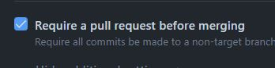
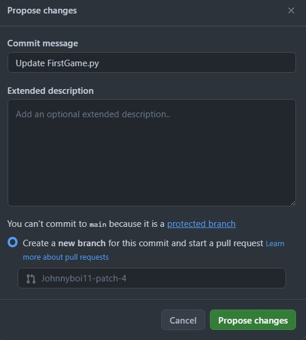
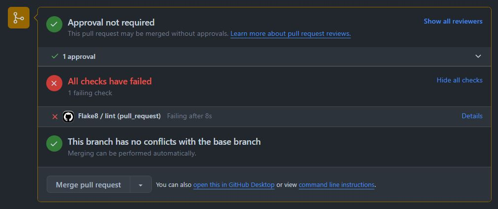
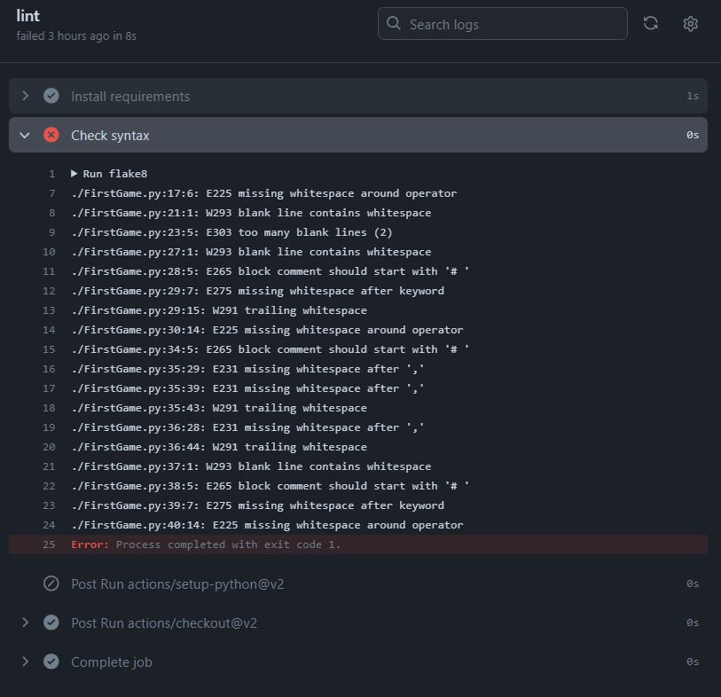
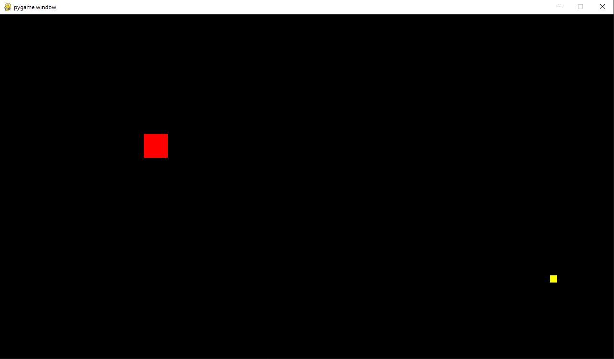
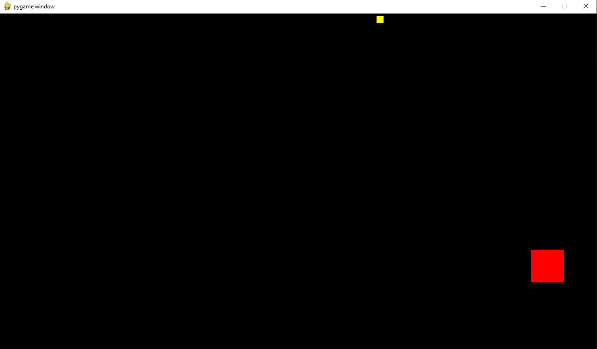
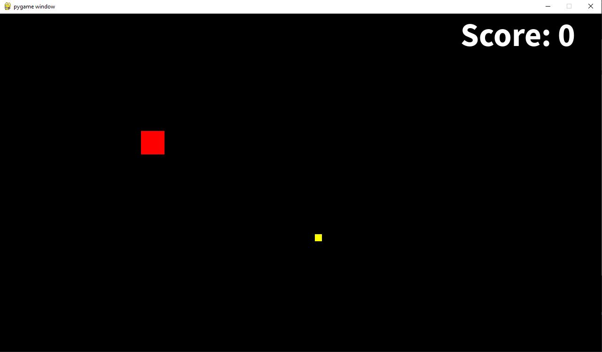
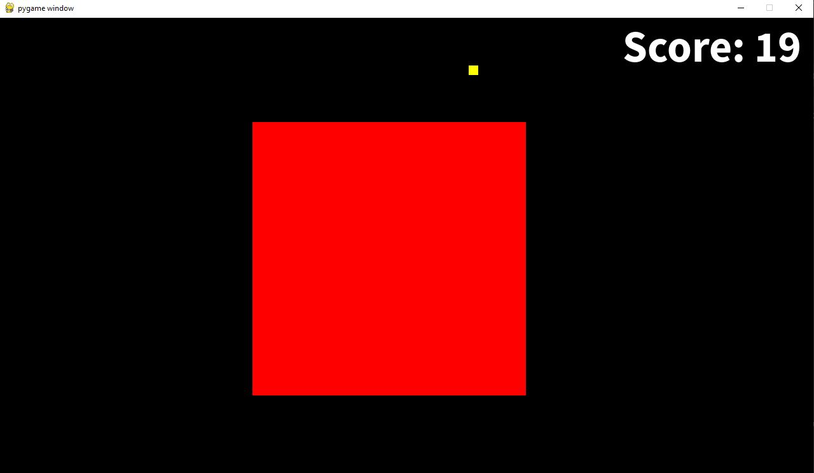

# Results of Sprint 1

### 1. Created Github Repository

### 2. Disallowed direct pushes
- changes only possible using pull requests

### 3. Created a Github.io page

 
### 4. Added Github action - flake8
- flake8 tests are performed on each new Pull Request
  

 

### 5. Created pyGame Program "BigSquare"
- In the game you can play a red square that you can move via wasd-keys. There is also food in the game, represented by yellow squares, which the player can eat when he is colliding with them. Whenever the player eats one of the yellow squares the player gets bigger and a yellow square spawns at a different location of the screen.

- A score Counter keeps track of how much food the player has eaten. The goal is to get as big as possible.

